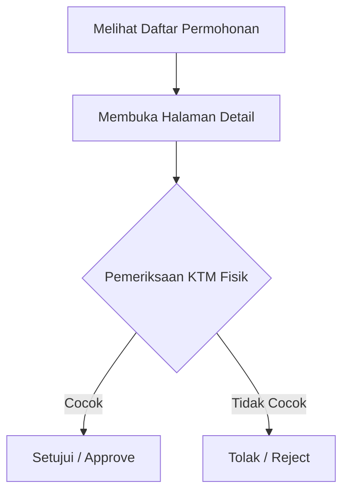

# Dokumentasi Sistem UPT Perpustakaan IAIN Sorong

Dokumentasi ini mencakup rincian server VPS, kredensial akses, repositori git, modul transaksi peminjaman ruangan, dan sistem keamanan login baru.

---

## 🖥️ Informasi Server & Deployment

Aplikasi berjalan di VPS Ubuntu 26.04 menggunakan panel kontrol **aaPanel** dan dikonfigurasi menggunakan PHP 8.4 dan Nginx.

### Kredensial VPS & Website
| Parameter | Nilai / Keterangan |
| :--- | :--- |
| **Domain Aplikasi** | [https://dash-perpus.emsacode.com](https://dash-perpus.emsacode.com) |
| **IP Address** | `185.190.58.196` |
| **SSH Username** | `root` |
| **SSH Password** | `bu\KxTM8GKM` |
| **Database** | SQLite (`database/database.sqlite`) |

> [!info] **Cloudflare Proxy**
> Domain `dash-perpus.emsacode.com` berada di balik proxy Cloudflare (`104.21.40.89`). Jika terjadi kendala tampilan tidak berubah setelah pembaruan, lakukan hard reload (`Ctrl + F5` atau `Cmd + Shift + R`) atau bersihkan cache di dashboard Cloudflare.

---

### Konfigurasi Server Web (Nginx & PHP)
- **Path Root Aplikasi**: `/www/wwwroot/dash-perpus.emsacode.com`
- **Konfigurasi Nginx**: `/www/server/panel/vhost/nginx/dash-perpus.emsacode.com.conf`
  - Terkonfigurasi untuk mengarahkan ke sub-folder `/public`.
  - Menggunakan Socket PHP 8.4-FPM: `/tmp/php-cgi-84.sock`.
- **Ekstensi PHP Fileinfo**: Dikompilasi secara manual di direktori `/www/server/php/84/src/ext/fileinfo`.
- **SSL Let's Encrypt**: Terpasang di `/etc/letsencrypt/live/dash-perpus.emsacode.com/`.

---

### Otomatisasi Scheduler (Cron Job)
Sistem pembatalan otomatis berjalan setiap menit menggunakan cron job berikut yang terdaftar di system crontab:
```bash
* * * * * cd /www/wwwroot/dash-perpus.emsacode.com && /www/server/php/84/bin/php artisan schedule:run >> /dev/null 2>&1
```

---

## 🛠️ Repositori Git

Kode sumber backend dikelola pada repositori GitHub berikut:
- **Tautan Repositori**: `https://github.com/emsacode/cms-perpustakaan-iain-sorong.git`
- **Branch Utama**: `main`

---

## 🔑 Sistem Keamanan & Halaman Login

Halaman login baru dirancang dengan layout **split screen** premium:
- **Tautan Akses**: [https://dash-perpus.emsacode.com/admin/login](https://dash-perpus.emsacode.com/admin/login)
- **Desain**:
  - **Kiri (Banner)**: Foto estetik perpustakaan modern dengan kutipan motivasi dari Rektor IAIN Sorong (**Dr. Hamzah Khaeriyah, M.Ag.**).
  - **Kanan (Form)**: Formulir responsif berbasis Livewire dengan dukungan Google SSO.
- **Middleware**: Seluruh rute `/admin/*` dilindungi dengan middleware `auth`. Pengguna yang belum masuk akan dialihkan secara otomatis ke `/admin/login`.

### Akun Petugas Default (Seeded)
> [!key] Kredensial Administrator
> - **Email**: `admin@iainsorong.ac.id`
> - **Kata Sandi**: `password`

---

## 🚪 Modul Peminjaman Ruangan

Modul ini memfasilitasi civitas akademika untuk meminjam ruangan perpustakaan seperti Ruang Multimedia, Home Theater, dan Ruang Diskusi Kelompok.

### Alur Transaksi Pustakawan


1. **Daftar Permohonan** (`/admin/reservations`): Menampilkan list permohonan masuk dengan status *pending*, *approved*, *rejected*, atau *cancelled*.
2. **Detail Permohonan** (`/admin/reservations/{id}`):
   - Halaman khusus (bukan pop-up) menampilkan status verifikasi identitas (NIM/NIP), detail jadwal, dan daftar fasilitas statis bawaan ruangan.
   - Pustakawan memverifikasi fisik KTM mahasiswa, mencocokkannya dengan NIP/NIM yang tertera di dashboard, lalu mengklik **Approve** (tombol hijau) atau **Reject** (tombol merah dengan alasan penolakan).

### Aturan Auto-Cancellation (Toleransi 15 Menit)
- Jika permohonan sudah **Approved**, mahasiswa wajib mengambil kunci ruangan dalam waktu **15 menit** dari jam mulai sesi booking.
- Jika waktu terlewati dan status belum diserahkan (kunci belum diambil), sistem akan secara otomatis membatalkan reservasi tersebut (mengubah status menjadi `cancelled`) agar slot waktu dapat dipesan oleh mahasiswa lain.
- Logika ini dipicu setiap kali halaman daftar reservasi dimuat, serta secara berkala oleh Laravel Background Scheduler setiap 10 menit.

---

## 🧪 Rencana Verifikasi & Pengujian Kode

Semua fungsi diuji secara otomatis sebelum dideploy. Perintah pengujian lokal:
```bash
php artisan test
```

### Daftar File yang Dimodifikasi
- `app/Livewire/Admin/Login.php` (Livewire Controller Login)
- `resources/views/livewire/admin/login.blade.php` (Tampilan Login)
- `resources/views/layouts/guest.blade.php` (Layout Khusus Login)
- `routes/web.php` (Konfigurasi Route Keamanan & Login)
- `app/Livewire/Admin/Reservations.php` (Reservations List Controller)
- `app/Livewire/Admin/ReservationDetail.php` (Reservation Detail Controller)
- `resources/views/livewire/admin/reservation-detail.blade.php` (Tampilan Transaksi & Verifikasi)
- `app/Models/Reservation.php` (Model data & Logika Auto-Cancellation)
- `tests/Feature/AuthTest.php` (Unit Test Otentikasi & Halaman Login)
- `tests/Feature/ReservationTest.php` (Unit Test Alur Peminjaman Ruangan)
- `routes/console.php` (Pendaftaran Task Scheduler Pengecekan 15 Menit)
